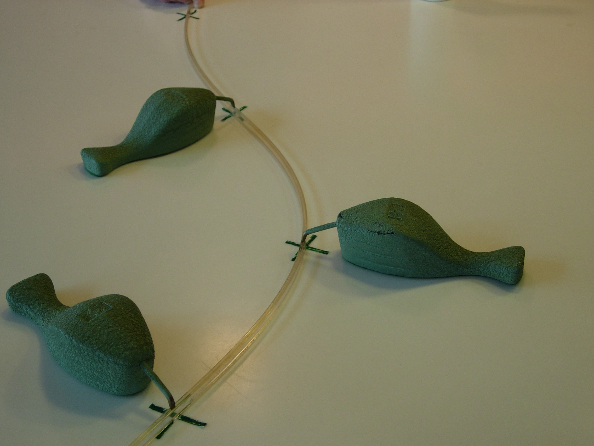

```{r setup, include=FALSE}
knitr::opts_chunk$set(echo = FALSE, cache=TRUE, warning=FALSE, message=FALSE,
                      dev.args=list(bg=grey(0.9), pointsize=11))
library(fpp2)
library(knitr)
library(splines)

```

# The linear model with time series

## Multiple regression and forecasting

$y_t = \beta_0 + \beta_1 x_{1,t} + \beta_2 x_{2,t} + \cdots + \beta_kx_{k,t} + \varepsilon_t$

* $y_t$ is the variable we want to predict: the `response` variable
* Each $x_{j,t}$ is numerical and is called a `predictor`.
They are usually assumed to be known for all past and future times.

* The coefficients $\beta_1,\dots,\beta_k$ measure the effect of each
predictor after taking account of the effect of all other predictors
in the model.

That is, the coefficients measure the **marginal effects**.

* $\varepsilon_t$ is a white noise error term


## Example: US consumption expenditure

```{r uschangedata, echo=FALSE, fig.height=3.5}
quarters <- rownames(.preformat.ts(uschange))
```

```{r ConsInc, echo=TRUE, cache=TRUE, fig.height=3.5}
autoplot(uschange[,c("Consumption","Income")]) +
  ylab("% change") + xlab("Year") +
  theme(legend.position="bottom")  +
  ggtitle("US growth rates of personal consumption and personal income")
```

```{r ConsInc2, echo=FALSE, cache=TRUE}
fit.cons <- tslm(Consumption ~ Income, data=uschange)
uschange %>%
  as.data.frame %>%
  ggplot(aes(x=Income, y=Consumption)) +
  ylab("Consumption (quarterly % change)") +
  xlab("Income (quarterly % change)") +
  geom_point() +
  geom_smooth(method="lm", se=FALSE)
```

```{r, echo=TRUE, cache=TRUE}
tslm(Consumption ~ Income, data=uschange) %>% summary
```

Additional predictors that may be useful for forecasting US consumption expenditure.

```{r MultiPredictors, echo=FALSE, cache=TRUE}
autoplot(uschange[,3:5], facets = TRUE, colour=TRUE) +
  ylab("") + xlab("Year") +
  guides(colour="none")
```

Scatterplot matrix of five variables. The first column shows the relationships between the forecast variable (consumption) and each of the predictors. The scatterplots show positive relationships with income and industrial production, and negative relationships with savings and unemployment. The strength of these relationships are shown by the correlation coefficients across the first row. The remaining scatterplots and correlation coefficients show the relationships between the predictors.

```{r ScatterMatrix, echo=FALSE, cache=TRUE}
uschange %>%
  as.data.frame %>%
  GGally::ggpairs()
```

The following output provides information about the fitted model.

```{r usestim, echo=TRUE, fig.height=3.5}
fit.consMR <- tslm(
  Consumption ~ Income + Production + Unemployment + Savings,
  data=uschange)
summary(fit.consMR)
```
The following plots show the actual values compared to the fitted values for the percentage change in the US consumption expenditure series.

```{r usfitted1, echo=FALSE, cache=TRUE}
autoplot(uschange[,'Consumption'], series="Data") +
  autolayer(fitted(fit.consMR), series="Fitted") +
  xlab("Year") + ylab("") +
  ggtitle("Percentage change in US consumption expenditure") +
  guides(colour=guide_legend(title=" ")) +
  theme(legend.position="bottom")
```

```{r usfitted2, echo=FALSE, cache=TRUE, message=FALSE, warning=FALSE}
cbind(Data=uschange[,"Consumption"], Fitted=fitted(fit.consMR)) %>%
  as.data.frame %>%
  ggplot(aes(x=Data, y=Fitted)) +
  geom_point() +
  xlab("Fitted (predicted values)") +
  ylab("Data (actual values)") +
  ggtitle("Percentage change in US consumption expenditure") +
  geom_abline(intercept=0, slope=1)
```

A time plot, the ACF and the histogram of the residuals from the multiple regression model fitted to the US quarterly consumption data, as well as the Breusch-Godfrey test for jointly testing up to 8th order autocorrelation.

```{r}
checkresiduals(fit.consMR, test=FALSE)
```

The time plot shows some changing variation over time, but is otherwise relatively unremarkable. This heteroscedasticity will potentially make the prediction interval coverage inaccurate.

The histogram shows that the residuals seem to be slightly skewed, which may also affect the coverage probability of the prediction intervals.

The autocorrelation plot shows a significant spike at lag 7, but it is not quite enough for the Breusch-Godfrey to be significant at the 5% level. The autocorrelation is not particularly large, and at lag 7 it is unlikely to have any noticeable impact on the forecasts or the prediction intervals.

# Residual diagnostics

```{r}
df <- as.data.frame(uschange)
df[,"Residuals"]  <- as.numeric(residuals(fit.consMR))
p1 <- ggplot(df, aes(x=Income, y=Residuals)) +
  geom_point()
p2 <- ggplot(df, aes(x=Production, y=Residuals)) +
  geom_point()
p3 <- ggplot(df, aes(x=Savings, y=Residuals)) +
  geom_point()
p4 <- ggplot(df, aes(x=Unemployment, y=Residuals)) +
  geom_point()
gridExtra::grid.arrange(p1, p2, p3, p4, nrow=2)
```

Residuals from the multiple regression model for forecasting US consumption plotted against each predictor seem to be randomly scattered.

```{r}
cbind(Fitted = fitted(fit.consMR),
      Residuals=residuals(fit.consMR)) %>%
  as.data.frame() %>%
  ggplot(aes(x=Fitted, y=Residuals)) + geom_point()
```

Residuals plotted against the fitted values. The random scatter suggests the errors are homoscedastic.

##  Multiple regression and forecasting
For forecasting purposes, we require the following assumptions:

* $\varepsilon_t$ are uncorrelated and zero mean

* $\varepsilon_t$ are uncorrelated with each $x_{j,t}$.

It is **useful** to also have $\varepsilon_t \sim \text{N}(0,\sigma^2)$ when producing prediction intervals or doing statistical tests.

## Residual plots

Useful for spotting outliers and whether the linear model was
appropriate.

* Scatterplot of residuals $\varepsilon_t$ against each predictor $x_{j,t}$.

* Scatterplot residuals against the fitted values $\hat y_t$

* Expect to see scatterplots resembling a horizontal band with
no values too far from the band and no patterns such as curvature or
increasing spread.

## Residual patterns

* If a plot of the residuals vs any predictor in the model shows a pattern, then the relationship is nonlinear.

* If a plot of the residuals vs any predictor **not** in the model shows a pattern, then the predictor should be added to the model.

* If a plot of the residuals vs fitted values shows a pattern, then there is heteroscedasticity in the errors. (Could try a transformation.)

## Breusch-Godfrey test

**OLS regression:**
$$y_{t}=\beta_{0}+\beta_{1}x_{t,1}+\dots+\beta_{k}x_{t,k}+u_{t}$$
**Auxiliary regression:**
$${\hat {u}}_{t}=\beta_{0}+\beta_{1}x_{t,1}+\dots+\beta_{k}x_{t,k}+\rho_{1}{\hat {u}}_{t-1}+\dots +\rho_{p}{\hat {u}}_{t-p}+\varepsilon_{t}$$
If $R^{2}$ statistic is calculated for this model, then
$$
(T-p)R^{2}\,\sim \,\chi_{p}^{2},
$$
when there is no serial correlation up to lag $p$, and $T=$ length of series.

* Breusch-Godfrey test better than Ljung-Box for regression models.

## US consumption again

```{r}
checkresiduals(fit.consMR, plot=FALSE)
```

If the model fails the Breusch-Godfrey test \dots

* The forecasts are not wrong, but have higher variance than they need to.
* There is information in the residuals that we should exploit.
* This is done with a regression model with ARMA errors.

# Some useful predictors for linear models

## Trend

**Linear trend**
$x_t = t$

* $t=1,2,\dots,T$
* Strong assumption that trend will continue.

## Dummy variables

If a categorical variable takes only two values (e.g., `Yes`
or `No`), then an equivalent numerical variable can be constructed
taking value 1 if yes and 0 if no. This is called a **dummy** variable}.

If there are more than two categories, then the variable can
be coded using several dummy variables (one fewer than the total
number of categories).


## Beware of the dummy variable trap!

* Using one dummy for each category gives too many dummy variables!

* The regression will then be singular and inestimable.

* Either omit the constant, or omit the dummy for one category.

* The coefficients of the dummies are relative to the omitted category.

## Uses of dummy variables

**Seasonal dummies**

* For quarterly data: use 3 dummies
* For monthly data: use 11 dummies
* For daily data: use 6 dummies
* What to do with weekly data?

**Outliers**

* If there is an outlier, you can use a dummy variable (taking value 1 for that observation and 0 elsewhere) to remove its effect.


**Public holidays**

* For daily data: if it is a public holiday, dummy=1, otherwise dummy=0.


## Beer production revisited

```{r, echo=FALSE}
beer <- window(ausbeer, start=1992)
autoplot(beer) + xlab("Year") + ylab("megalitres") +
  ggtitle("Australian quarterly beer production")
```

Regression model

$y_t = \beta_0 + \beta_1 t + \beta_2d_{2,t} + \beta_3 d_{3,t} + \beta_4 d_{4,t} + \varepsilon_t$

* $d_{i,t} = 1$ if $t$ is quarter $i$ and 0 otherwise.

```{r, echo=TRUE}
fit.beer <- tslm(beer ~ trend + season)
summary(fit.beer)
```
There is an average downward trend of -0.34 megalitres per quarter. On average, the second quarter has production of 34.7 megalitres lower than the first quarter, the third quarter has production of 17.8 megalitres lower than the first quarter, and the fourth quarter has production of 72.8 megalitres higher than the first quarter.

```{r}
autoplot(beer, series="Data") +
  autolayer(fitted(fit.beer), series="Fitted") +
  xlab("Year") + ylab("Megalitres") +
  ggtitle("Quarterly Beer Production") +
  theme(legend.position="bottom")
```

```{r, echo=FALSE}
cbind(Data=beer, Fitted=fitted(fit.beer)) %>%
  as.data.frame %>%
  ggplot(aes(x=Data, y=Fitted, colour=as.factor(cycle(beer)))) +
  geom_point() +
  ylab("Fitted") + xlab("Actual values") +
  ggtitle("Quarterly beer production") +
  scale_colour_brewer(palette="Dark2", name="Quarter") +
  geom_abline(intercept=0, slope=1) +
  theme(legend.position="bottom")
```

```{r}
checkresiduals(fit.beer, test=FALSE)
```

```{r}
fit.beer %>% forecast %>% autoplot +
  theme(legend.position="bottom")
```

## Fourier series

Periodic seasonality can be handled using pairs of Fourier terms:

$$
s_{k}(t) = \sin\left(\frac{2\pi k t}{m}\right)\qquad c_{k}(t) = \cos\left(\frac{2\pi k t}{m}\right)
$$
$$
y_t = a + bt + \sum_{k=1}^K \left[\alpha_k s_k(t) + \beta_k c_k(t)\right] + \varepsilon_t$$

* Every periodic function can be approximated by sums of sin and cos terms for large enough $K$.
* Choose $K$ by minimizing AICc.
* Called "harmonic regression"

```r
fit <- tslm(y ~ trend + fourier(y, K))
```

## Harmonic regression: beer production

```{r fourierbeer, echo=TRUE, cache=TRUE}
fourier.beer <- tslm(beer ~ trend + fourier(beer, K=2))
summary(fourier.beer)
```

## Intervention variables

**Spikes**

* Equivalent to a dummy variable for handling an outlier.

**Steps**

* Variable takes value 0 before the intervention and 1 afterwards.

**Change of slope**

* Variables take values 0 before the intervention and values $\{1,2,3,\dots\}$ afterwards.

##  Holidays

**For monthly data**

* Christmas: always in December so part of monthly seasonal effect
* Easter: use a dummy variable $v_t=1$ if any part of Easter is in that month, $v_t=0$ otherwise.
* Ramadan and Chinese new year similar.

## Trading days

With monthly data, if the observations vary depending on how many different types of days in the month, then trading day predictors can be useful.

<!-- \begin{align*} -->
<!-- z_1 &= \text{\# Mondays in month;} \\ -->
<!-- z_2 &= \text{\# Tuesdays in month;} \\ -->
<!-- &\vdots \\ -->
<!-- z_7 &= \text{\# Sundays in month.} -->
<!-- \end{align*} -->


## Distributed lags

Lagged values of a predictor.

Example: $x$ is advertising which has a delayed effect

<!-- \begin{align*} -->
<!--   x_{1} &= \text{advertising for previous month;} \\ -->
<!--   x_{2} &= \text{advertising for two months previously;} \\ -->
<!--         & \vdots \\ -->
<!--   x_{m} &= \text{advertising for $m$ months previously.} -->
<!-- \end{align*} -->


## Nonlinear trend

**Piecewise linear trend with bend at $\tau$**
<!-- \begin{align*} -->
<!-- x_{1,t} &= t \\ -->
<!-- x_{2,t} &= \left\{ \begin{array}{ll} -->
<!--   0 & t <\tau\\ -->
<!--   (t-\tau) & t \ge \tau -->
<!-- \end{array}\right. -->
<!-- \end{align*} -->
<!-- **\vspace*{1cm} -->

<!-- **Quadratic or higher order trend** -->
<!-- \[ -->
<!--   x_{1,t} =t,\quad x_{2,t}=t^2,\quad \dots -->
<!-- \] -->
<!-- **\vspace*{-0.5cm} -->

<!-- \centerline{\textcolor{orange}{**NOT RECOMMENDED!}}} -->


## Example: Boston marathon winning times

```{r, fig.height=3.5, echo=TRUE}
autoplot(marathon) +
  xlab("Year") +  ylab("Winning times in minutes")
fit.lin <- tslm(marathon ~ trend)
```

```{r marathonLinear, echo=FALSE, message=TRUE, warning=FALSE, cache=TRUE}
autoplot(marathon) +
  autolayer(fitted(fit.lin), series = "Linear trend") +
  xlab("Year") +  ylab("Winning times in minutes") +
  guides(colour=guide_legend(title=" ")) +
  theme(legend.position = "none")
```

```{r, echo=TRUE, fig.height=3.5}
autoplot(residuals(fit.lin)) +
  xlab("Year") + ylab("Residuals from a linear trend")
```

- Linear trend

```{r, echo=TRUE, message=TRUE, warning=FALSE, cache=TRUE}
fit.lin <- tslm(marathon ~ trend)
fcasts.lin <- forecast(fit.lin, h=10)
```

- Exponential trend

```{r, echo=TRUE, message=TRUE, warning=FALSE, cache=TRUE}
fit.exp <- tslm(marathon ~ trend, lambda = 0)
fcasts.exp <- forecast(fit.exp, h=10)
```

- Piecewise linear trend

```{r}
t.break1 <- 1940
t.break2 <- 1980
t <- time(marathon)
t1 <- ts(pmax(0, t-t.break1), start=1897)
t2 <- ts(pmax(0, t-t.break2), start=1897)
fit.pw <- tslm(marathon ~ t + t1 + t2)
t.new <- t[length(t)] + seq(10)
t1.new <- t1[length(t1)] + seq(10)
t2.new <- t2[length(t2)] + seq(10)
newdata <- cbind(t=t.new, t1=t1.new, t2=t2.new) %>%
  as.data.frame
fcasts.pw <- forecast(fit.pw, newdata = newdata)
```

```{r, echo=FALSE, message=TRUE, warning=FALSE, cache=TRUE}
autoplot(marathon) +
  autolayer(fitted(fit.lin), series = "Linear") +
  autolayer(fitted(fit.exp), series="Exponential") +
  autolayer(fitted(fit.pw), series = "Piecewise") +
  autolayer(fcasts.pw, series="Piecewise") +
  autolayer(fcasts.lin$mean, series = "Linear") +
  autolayer(fcasts.exp$mean, series="Exponential") +
  xlab("Year") +  ylab("Winning times in minutes") +
  ggtitle("Boston Marathon") +
  guides(colour=guide_legend(title=" ")) +
  theme(legend.position="bottom")
```

```{r residPiecewise, message=FALSE, warning=FALSE, cache=TRUE}
fit.pw$method <- "Piecewise linear regression model"
checkresiduals(fit.pw, test=FALSE)
```

## Interpolating splines

```{r,out.width = "80%"}

```

```{r,out.width = "80%"}

```

```{r,out.width = "80%"}

```

A spline is a continuous function $f(x)$ interpolating all
points ($\kappa_j,y_j$) for $j=1,\dots,K$ and consisting of polynomials between each consecutive pair of `knots' $\kappa_j$ and $\kappa_{j+1}$.

* Parameters constrained so that $f(x)$ is continuous.
* Further constraints imposed to give continuous derivatives.

##  General linear regression splines

* Let $\kappa_1<\kappa_2<\cdots<\kappa_K$ be ``knots'' in interval $(a,b)$.
* Let $x_1=x$, $x_j = (x-\kappa_{j-1})_+$ for $j=2,\dots,K+1$.
* Then the regression is piecewise linear with bends at the knots.

## General cubic splines

* Let $x_1=x$, $x_2 = x^2$, $x_3=x^3$, $x_j =
(x-\kappa_{j-3})_+^3$ for $j=4,\dots,K+3$.

* Then the regression is piecewise cubic, but smooth at the knots.

* Choice of knots can be difficult and arbitrary.

* Automatic knot selection algorithms very slow.

## Example: Boston marathon winning times

```{r, echo=TRUE, message=TRUE, warning=FALSE, cache=TRUE}
# Spline trend
t <- time(marathon)
fit.splines <- lm(marathon ~ ns(t, df=6))
summary(fit.splines)
fits <- ts(fitted(fit.splines))
tsp(fits) <- tsp(marathon)
```

```{r, echo=FALSE, message=FALSE, warning=FALSE, cache=TRUE}
fc <- predict(fit.splines, newdata=data.frame(t=time(fcasts.pw$mean)),
              interval='prediction', level=0.95)
fcasts.spline <- fcasts.pw
fcasts.spline$mean <- fc[,"fit"]
se <- (fc[,'upr'] - fc[,'lwr'])/(2*qnorm(0.975))
fcasts.spline$lower[,2] <- fc[,'fit'] - qnorm(.975)*se
fcasts.spline$lower[,1] <- fc[,'fit'] - qnorm(.90)*se
fcasts.spline$upper[,2] <- fc[,'fit'] + qnorm(.975)*se
fcasts.spline$upper[,1] <- fc[,'fit'] + qnorm(.90)*se

autoplot(marathon) +
  autolayer(fitted(fit.pw), series = "Piecewise linear") +
  autolayer(fcasts.pw, series="Piecewise linear") +
  autolayer(fits, series = "Cubic spline") +
  autolayer(fcasts.spline, series="Cubic spline") +
  xlab("Year") +  ylab("Winning times in minutes") +
  ggtitle("Boston Marathon") +
  guides(colour=guide_legend(title=" ")) +
  theme(legend.position="bottom")
```

## splinef

A slightly different type of spline is provided by `splinef`

```{r, echo=TRUE, fig.height=3.3}
fc <- splinef(marathon)
autoplot(fc)
```

## splinef

* Cubic **smoothing** splines (rather than cubic regression splines).
* Still piecewise cubic, but with many more knots (one at each observation).
* Coefficients constrained to prevent the curve becoming too "wiggly".
* Degrees of freedom selected automatically.
* Equivalent to ARIMA(0,2,2) and Holt's method.


# Selecting predictors and forecast evaluation

## Selecting predictors

* When there are many predictors, how should we choose which ones to use?

* We need a way of comparing two competing models.

**What not to do!**

* Plot $y$ against a particular predictor ($x_j$) and if it shows no noticeable relationship, drop it.

* Do a multiple linear regression on all the predictors and disregard all variables whose  $p$ values are greater than 0.05.

* Maximize $R^2$ or minimize MSE

## Comparing regression models

Computer output for regression will always give the $R^2$ value. This is a
useful summary of the model.

* It is equal to the square of the correlation between $y$ and $\hat y$.
* It is often called the ``coefficient of determination''.
* It can also be calculated as follows:
$$R^2 = \frac{\sum(\hat{y}_t - \bar{y})^2}{\sum(y_t-\bar{y})^2}
$$
* It is the proportion of variance accounted for (explained) by the predictors.

However $\dots$

* $R^2$  does not allow for `degrees of freedom`.

* Adding *any* variable tends to increase the value of $R^2$, even if that variable is irrelevant.

To overcome   this problem, we can use adjusted $R^2$:

$\bar{R}^2 = 1-(1-R^2)\frac{T-1}{T-k-1}$

where $k=$ no.\ predictors and $T=$ no.\ observations.

Maximizing $\bar{R}^2$ is equivalent to minimizing $\hat\sigma^2$.

$\hat{\sigma}^2 = \frac{1}{T-k-1}\sum_{t=1}^T \varepsilon_t^2$

## Cross-validation

**Cross-validation for regression**

(Assuming future predictors are known)

* Select one observation for test set, and use \emph{remaining} observations in training set. Compute error on test observation.
* Repeat using each possible observation as the test set.
* Compute accuracy measure over all errors.

```{r traintest0, fig.height=.6, echo=FALSE, cache=TRUE}
train = 1:16
test = 17:20
par(mar=c(0,0,0,0))
plot(0,0,xlim=c(0,22),ylim=c(0,2),xaxt="n",yaxt="n",bty="n",xlab="",ylab="",type="n")
arrows(0,0.5,21,0.5,0.05)
points(train, train*0+0.5, pch=19, col="blue")
points(test,  test*0+0.5,  pch=19, col="red")
text(22,0.5,"time")
text(10,1,"Training data",col="blue")
text(21,1,"Test data",col="red")
```

**Leave-one-out cross-validation**

```{r, fig.height=3.6}
kcvplot <- function(k,n)
{
  par(mar=c(0,0,0,0))
  each <- round(n/k)
  ord <- sample(1:n,n)
  plot(0,0, xlim=c(0,n+2), ylim=c(1-k/n,1-1/n),
       xaxt="n", yaxt="n", bty="n", xlab="", ylab="", type="n")
  for(j in 1:k)
  {
    test <- (1:n)[ord[(j-1)*each + (1:each)]]
    train <- (1:n)[-test]
    arrows(0, 1-j/n, n+1, 1-j/n, 0.05)
    points(train,rep(1-j/n,length(train)),pch=19,col="blue")
    points(test, rep(1-j/n,length(test)), pch=19, col="red")
    #text(28,1-j/11,"time")
  }
}
kcvplot(20,20)
```

Leave-one-out cross-validation for regression can be carried out using the following steps.

* Remove observation $t$ from the data set, and fit the model using the remaining data. Then compute the error ($e_t^*=y_t-\hat{y}_t$) for the omitted observation.
* Repeat step 1 for $t=1,\dots,T$.
* Compute the MSE from $\{e_1^*,\dots,e_T^*\}$. We shall call this the CV.

The best model is the one with minimum CV.

**Five-fold cross-validation**

* 20 observations. 4 test observations per fold

```{r, fig.height=1.}
kcvplot(5,20)
```

**Ten-fold cross-validation**

* 20 observations. 2 test observations per fold

```{r, fig.height=2.}
kcvplot(10,20)
```

Ten-fold cross-validation

* Randomly split data into 10 parts.
* Select one part for test set, and use remaining parts as training set. Compute accuracy measures on test observations.
* Repeat for each of 10 parts
* Average over all measures.

## Akaike's Information Criterion

$\text{AIC} = -2\log(L) + 2(k+2)$

where $L$ is the likelihood and $k$ is the number of predictors in the model.**

* This is a \emph{penalized likelihood} approach.
* \emph{Minimizing} the AIC gives the best model for prediction.
* AIC penalizes terms more heavily than $\bar{R}^2$.
* Minimizing the AIC is asymptotically equivalent to minimizing MSE via leave-one-out cross-validation.

## Corrected AIC

For small values of $T$, the AIC tends to select too many predictors, and so a bias-corrected version of the AIC has been developed.

$\text{AIC}_{\text{C}} = \text{AIC} + \frac{2(k+2)(k+3)}{T-k-3}$

As with the AIC, the AIC$_{\text{C}}$ should be minimized.

## Bayesian Information Criterion

$\text{BIC} = -2\log(L) + (k+2)\log(T)$

where $L$ is the likelihood and $k$ is the number of predictors in the model.**

* BIC penalizes terms more heavily than AIC

* Also called SBIC and SC.

* Minimizing BIC is asymptotically equivalent to leave-$v$-out cross-validation when $v = T[1-1/(log(T)-1)]$.

## Choosing regression variables

**Best subsets regression**

* Fit all possible regression models using one or more of the predictors.

* Choose the best model based on one of the measures of predictive ability (CV, AIC, AICc).

**Warning!**

* If there are a large number of predictors, this is not possible.

* For example, 44 predictors leads to 18 trillion possible models!

**Backwards stepwise regression**

* Start with a model containing all variables.
* Try subtracting one variable at a time. Keep the model if it
has lower CV or AICc.
* Iterate until no further improvement.

**Notes**

* Stepwise regression is not guaranteed to lead to the best possible
model.
* Inference on coefficients of  final model will be wrong.

```{r, echo=TRUE}
tslm(Consumption ~ Income + Production + Unemployment + Savings,
     data=uschange) %>% CV()
tslm(Consumption ~ Income + Production + Unemployment,
     data=uschange) %>% CV()
tslm(Consumption ~ Income + Production + Savings,
     data=uschange) %>% CV()
tslm(Consumption ~ Income + Unemployment + Savings,
     data=uschange) %>% CV()
tslm(Consumption ~ Production + Unemployment + Savings,
     data=uschange) %>% CV()
```

# Forecasting with regression

## Ex-ante versus ex-post forecasts

* *Ex ante forecasts* are made using only information available in advance.
- require forecasts of predictors
* *Ex post forecasts* are made using later information on the predictors.
- useful for studying behaviour of forecasting models.

* trend, seasonal and calendar variables are all known in advance, so these do not need to be forecast.

## Scenario based forecasting

* Assumes possible scenarios for the predictor variables
* Prediction intervals for scenario based forecasts do not include the uncertainty associated with the future values of the predictor variables.

## Building a predictive regression model

* If getting forecasts of predictors is difficult, you can use lagged predictors instead.
$$y_{t}=\beta_0+\beta_1x_{1,t-h}+\dots+\beta_kx_{k,t-h}+\varepsilon_{t}$$

* A different model for each forecast horizon $h$.

## Beer production

```{r beeryetagain, echo=TRUE, fig.height=3.5}
beer2 <- window(ausbeer, start=1992)
fit.beer <- tslm(beer2 ~ trend + season)
fcast <- forecast(fit.beer)
autoplot(fcast) +
  ggtitle("Forecasts of beer production using regression") +
  xlab("Year") + ylab("megalitres") +
  theme(legend.position="bottom")
```

## US Consumption

```{r usconsumptionf, echo=TRUE}
fit.consBest <- tslm(
  Consumption ~ Income + Savings + Unemployment,
  data = uschange)
h <- 4
newdata <- data.frame(
  Income = c(1, 1, 1, 1),
  Savings = c(0.5, 0.5, 0.5, 0.5),
  Unemployment = c(0, 0, 0, 0))
fcast.up <- forecast(fit.consBest, newdata = newdata)
newdata <- data.frame(
  Income = rep(-1, h),
  Savings = rep(-0.5, h),
  Unemployment = rep(0, h))
fcast.down <- forecast(fit.consBest, newdata = newdata)
```

```{r usconsumptionf2, echo=TRUE, fig.height=3.5}
autoplot(uschange[, 1]) +
  ylab("% change in US consumption") +
  autolayer(fcast.up, PI = TRUE, series = "increase") +
  autolayer(fcast.down, PI = TRUE, series = "decrease") +
  guides(colour = guide_legend(title = "Scenario")) +
  theme(legend.position="bottom")
```

# Exercises 

## Exercise 1

Daily electricity demand for Victoria, Australia, during 2014 is contained in elecdaily. The data for the first 20 days can be obtained as follows.

```{r}
daily20 <- head(elecdaily,20)
```

Plot the data and find the regression model for Demand with temperature as an explanatory variable. Why is there a positive relationship?

```{r}
daily20 %>%
  as.data.frame() %>%
  ggplot(aes(x=Temperature, y=Demand)) +
  ylab("Electricity Demand") +
  xlab("Temperature") +
  geom_point() +
  geom_smooth(method="lm", se=FALSE)

tslm_dem_temp <- tslm(Demand ~ Temperature, data = daily20)
tslm_dem_temp
```

There is a positive relationship betweendemand with temperature. As temperature increased, people want to run air conditioner and fan and this increased the demand of electricity.

Produce a residual plot. Is the model adequate? Are there any outliers or influential observations?

```{r}
checkresiduals(tslm_dem_temp$residuals)
```

This model is adequate because residuals are not correlated (white noise) with each other and it roughly normally distributed.

Use the model to forecast the electricity demand that you would expect for the next day if the maximum temperature was 15∘and compare it with the forecast if the with maximum temperature was 35∘. Do you believe these forecasts?

```{r}
fc_dem_temp <- forecast(tslm_dem_temp, 
                        newdata=data.frame(Temperature=c(15,35)))
fc_dem_temp
```

Give prediction intervals for your forecasts. The following R code will get you started:

```{r}
autoplot(daily20, facets=TRUE)
daily20 %>%
  as.data.frame() %>%
  ggplot(aes(x=Temperature, y=Demand)) +
  geom_point() +
  geom_smooth(method="lm", se=FALSE)
fit <- tslm(Demand ~ Temperature, data=daily20)
checkresiduals(fit)
forecast(fit, newdata=data.frame(Temperature=c(15,35)))
```

```{r}
fc_dem_temp <- forecast(tslm_dem_temp, 
                        newdata=data.frame(daily20)$Temperature)
fc_dem_temp
```

Plot Demand vs Temperature for all of the available data in elecdaily. What does this say about your model?

```{r}
elecdaily %>%
  as.data.frame() %>%
  ggplot(aes(x=Temperature, y=Demand)) +
  geom_point() +
  geom_smooth(method="lm", se=FALSE)
```

The first model was made by few data points. The data of the first 20 days could be explained, but it was not right model for `elecdaily`.

## Exercise 2

Data set `mens400` contains the winning times (in seconds) for the men’s 400 meters final in each Olympic Games from 1896 to 2016.

Plot the winning time against the year. Describe the main features of the plot.

```{r}
autoplot(mens400)
```

- Feature 1: Winning times in Olympic men's 400m track final has a decreasing trend.
- Feature 2: There are missing values.

Fit a regression line to the data. Obviously the winning times have been decreasing, but at what average rate per year?

```{r}
time_mens400 <- time(mens400)
tslm_mens400 <- tslm(mens400 ~ time_mens400, data = mens400)
tslm_mens400
```

```{r}
autoplot(mens400) +
  geom_abline(slope = tslm_mens400$coefficients[2],
              intercept = tslm_mens400$coefficients[1],
              colour = "red")

mens400_df <- data.frame(Y=as.matrix(mens400), date=time(mens400)) 

mens400_df %>%
  ggplot(aes(x=date, y=Y)) +
  geom_point() +
  geom_smooth(method="lm", se=FALSE) +
  ggtitle("Winning times in Olympic men's 400m track final",
          subtitle = "1896-2016") +
  ylab("Seconds") + xlab("Year")
```

Plot the residuals against the year. What does this indicate about the suitability of the fitted line?

```{r}
mens400_df$residuals <- tslm_mens400$residuals
mens400_df <- data.frame(Y=as.matrix(mens400), date=time(mens400))
mens400_df$fitted <- predict(tslm_mens400, newdata=data.frame(mens400_df$date))


mens400_df %>%
  ggplot() +
  geom_point(aes(x=date, y=Y)) +
  geom_point(aes(x=date, y=fitted), color = "red") +
  ggtitle("Winning times in Olympic men's 400m track final Residuals",
          subtitle = "1896-2016") +
  ylab("Seconds") + xlab("Year")

checkresiduals(tslm_mens400)
```

The model residuals are not normally distributed.

The winning times have been decreasing at average rate of `r round(abs(tslm_mens400$coefficients[2]), 5)` seconds per year.

Predict the winning time for the men’s 400 meters final in the 2020 Olympics. Give a prediction interval for your forecasts. What assumptions have you made in these calculations?

```{r}
fc_mens400 <- forecast(tslm_mens400, 
                       newdata=data.frame(time_mens400 = 2020))
fc_mens400
```

```{r}
autoplot(mens400) +
  autolayer(fc_mens400, PI = TRUE)
```

## Exercise 3

Type `easter(ausbeer)` and interpret what you see.

```{r}
easter(ausbeer)
```

Data: Quarterly Australian beer production data. There are 218 data points.
Start is 1st quarter of 1956 and the last is the 2nd quarter of 2010.
`easter` function returns a vector of 0's or 1's or fractional parts in the observed time period. If full Easter holidays are in a time period, it returns 1, and returns 0 if there is not any. If the holidays are extended from a period to the other, easter function returns fractional portions to each of them.

## Exercise 4

The data set fancy concerns the monthly sales figures of a shop which opened in January 1987 and sells gifts, souvenirs, and novelties. The shop is situated on the wharf at a beach resort town in Queensland, Australia. The sales volume varies with the seasonal population of tourists. There is a large influx of visitors to the town at Christmas and for the local surfing festival, held every March since 1988. Over time, the shop has expanded its premises, range of products, and staff.

Produce a time plot of the data and describe the patterns in the graph. Identify any unusual or unexpected fluctuations in the time series.

Monthly sales for a souvenir shop on the wharf at a beach resort town in Queensland, Australia.

```{r}
autoplot(fancy) +
  ggtitle("Monthly Sales for a souvenir shop") +
  xlab("Year") + ylab("Australia Dollars") 
```

- seasonal variations increased exponentially

Explain why it is necessary to take logarithms of these data before fitting a model.

The size of the seasonal variations should be roughly the same across the whole series to be fitted well to a model. Fancy data shows that seasonal variations increased exponentially. It is necessary to take logarithms of the data.

Use R to fit a regression model to the logarithms of these sales data with a linear trend, seasonal dummies and a “surfing festival” dummy variable.

```{r}
fancy_log <- log(fancy)
autoplot(fancy_log) +
  ggtitle("Monthly Sales for a souvenir shop") +
  xlab("Year") + ylab("Australia Dollars (log)") 
```

Plot the residuals against time and against the fitted values. Do these plots reveal any problems with the model?

```{r}
time_fancy_log <- time(fancy_log)
tslm_fancy_log <- tslm(fancy_log ~ time_fancy_log, data = time_fancy_log)
tslm_fancy_log
```

```{r}
autoplot(fancy_log) +
  geom_abline(slope = tslm_fancy_log$coefficients[2],
              intercept = tslm_fancy_log$coefficients[1],
              colour = "red")

fancy_log_df <- data.frame(Y=as.matrix(fancy_log), date=time(fancy_log), month=month.abb[cycle(fancy_log)]) 

fancy_log_df %>%
  ggplot(aes(x=date, y=Y)) +
  geom_point() +
  geom_smooth(method="lm", se=FALSE) +
  ggtitle("Monthly Sales for a souvenir shop") +
  xlab("Year") + ylab("Australia Dollars (log)") 
```

Plot the residuals against the year. What does this indicate about the suitability of the fitted line?

```{r}
fancy_log_df$residuals <- tslm_fancy_log$residuals
fancy_log_df$fitted <- predict(tslm_fancy_log, newdata=data.frame(fancy_log_df$date))


autoplot(fancy_log, series="Data") +
  autolayer(fitted(tslm_fancy_log), series="Fitted") +
  ggtitle("Monthly Sales for a souvenir shop") +
  xlab("Year") + ylab("Australia Dollars (log)") + 
  guides(colour=guide_legend(title=" "))  +
  theme(legend.position="bottom") 

checkresiduals(tslm_fancy_log)
```

The size of the residuals changed as we move along the x-axis(fitted values). Even after log transformation, there are still heteroscedacity in the errors or that the variance of the residuals are not constant. 

Do boxplots of the residuals for each month. Does this reveal any problems with the model?

```{r}
fancy_log_df %>%
  ggplot() +
  geom_boxplot(aes(y = residuals, x = month))

ggsubseriesplot(tslm_fancy_log$residuals)
ggsubseriesplot(tslm_fancy_log$residuals)
```

Residuals are highest in December. The residuals have pattern so it means that there is correlation between residuals and time.

The distribution of the residuals is unsymetrical for some months. For some months, the mean of the residuals was not 0 (residuals' mean should be 0 for all months because getting the minimum SSE means getting mean). Residuals with such properties ca not have normal distribution, which will make it difficult to get prediction interval.

What do the values of the coefficients tell you about each variable?

```{r}
tslm_fancy_log$coefficients
```

<!-- # The model has positive trend. It means that as time goes on, the sales amount generally increases.  -->
<!-- # And all seasonal variables are positive. It means that the sales amount was minimum on January and the sales of the other months were greater than January for most of years.  -->
<!-- # Finally, surfing_festival variable's coefficient is 0.501 and it is not small compared to the others. It means that there were increased sales in Marchs when surfing festival happened. -->

What does the Breusch-Godfrey test tell you about your model?

```{r}
checkresiduals(tslm_fancy_log)
```

The p value of the test is less than 0.05 which means that the residuals can be distinguished from white noise. The residuals apper to be correlated with each other.

Regardless of your answers to the above questions, use your regression model to predict the monthly sales for 1994, 1995, and 1996. Produce prediction intervals for each of your forecasts.

```{r}
future_fancy <- rep(0, 36)

# make future data as time series.
future_fancy <- ts(data = future_fancy,
                   start = 1994,
                   end = c(1996, 12),
                   frequency = 12)

# forecast
fc_tslm_log_fancy <- forecast(
  tslm_fancy_log,
  newdata = data.frame(time_fancy_log = time(future_fancy))
)

# plot the forecast
autoplot(fc_tslm_log_fancy) +
  theme(legend.position="bottom")
```

Transform your predictions and intervals to obtain predictions and intervals for the raw data.

```{r}
fc_tslm_log_fancy
```

How could you improve these predictions by modifying the model?

```{r}
future_fancy <- rep(0, 36)

tslm_fancy_log <- tslm(BoxCox(fancy, 0) ~ trend + season)


# make future data as time series.
future_fancy <- ts(data = future_fancy,
                   start = 1994,
                   end = c(1996, 12),
                   frequency = 12)

# forecast
fc_tslm_log_fancy <- forecast(
  tslm_fancy_log,
  newdata = data.frame(time_fancy_log = time(future_fancy))
)

# plot the forecast
autoplot(fc_tslm_log_fancy) +
  theme(legend.position="bottom")

checkresiduals(fc_tslm_log_fancy)
```

## Exercise 5

The gasoline series consists of weekly data for supplies of US finished motor gasoline product, from 2 February 1991 to 20 January 2017. The units are in “million barrels per day”. Consider only the data to the end of 2004.

Fit a harmonic regression with trend to the data. Experiment with changing the number Fourier terms.

```{r}
gasoline_until_2004 <- window(gasoline, end = 2005)
autoplot(gasoline_until_2004, xlab = "Year") +
  ggtitle("US finished motor gasoline product supplied") +
  xlab("Year") + ylab("million barrels per day") 
```

```{r}
# make tslm model
for(num in c(1, 2, 3, 5, 10, 20)){
  #make variable names for each model using pair number.
  var_name <- paste("tslm_ft",
                    as.character(num),
                    "_gasoline_until_2004",
                    sep = "")
  
  #assign ts linear model to each variable name.
  assign(var_name,
         tslm(gasoline_until_2004 ~ trend + fourier(
           gasoline_until_2004,
           K = num
         ))
  )
  
  #plot the data and fitted values
  print(
    autoplot(gasoline_until_2004) +
      autolayer(get(var_name)$fitted.values,
                series = as.character(num)) +
      ggtitle(var_name) +
      ylab("gasoline") +
      guides(colour = guide_legend(title = "Number of Fourier Transform pairs")) +
  theme(legend.position="bottom")
  )
}
```

Plot the observed gasoline and fitted values and comment on what you see.

```{r}
autoplot(gasoline_until_2004) +
  autolayer(tslm_ft1_gasoline_until_2004$fitted.values, series = "1") +
  autolayer(tslm_ft5_gasoline_until_2004$fitted.values, series = "2") +
  autolayer(tslm_ft10_gasoline_until_2004$fitted.values, series = "3") +
  autolayer(tslm_ft10_gasoline_until_2004$fitted.values, series = "5") +
  autolayer(tslm_ft20_gasoline_until_2004$fitted.values, series = "10") +
  autolayer(tslm_ft20_gasoline_until_2004$fitted.values, series = "20") +
  guides(colour = guide_legend(title = "Fourier Transform pairs")) +
  scale_color_discrete(breaks = c(1, 2, 3, 5, 10, 20)) +
  theme(legend.position="bottom")
```

As more number of Fourier pairs used, the fitted line looks more like the original data. The fitted lines do not follow the trend well.

Select the appropriate number of Fourier terms to include by minimising the AICc or CV value.

```{r}
for(i in c(1, 2, 3, 5, 10, 20)){
  tslm_ft_gasoline_until_2004.name <- paste(
    "tslm_ft", as.character(i), "_gasoline_until_2004",
    sep = ""
  )
  writeLines(
    paste(
      "\n", tslm_ft_gasoline_until_2004.name, "\n"
    )
  )
  print(CV(get(tslm_ft_gasoline_until_2004.name)))
}
```

In the above K values (1, 2, 3, 5, 10, 20), k = 10 minimized the AICc and CV value.

```{r}
# Get exact number of Fourier pairs to minimize AICc or CV
min_AICc <- Inf
min_K_by_AICc <- 0
min_CV <- Inf
min_K_by_CV <- 0
AICc_K <- 0
CV_K <- 0

# maximum number of pairs is 26 because the frequency of gasoline data is about 52.18
for(num in 1:26){
  AICc_K <- CV(
    tslm(
      gasoline_until_2004 ~ trend + fourier(gasoline_until_2004, K = num)
    )
  )[["AICc"]]
  CV_K <- CV(
    tslm(
      gasoline_until_2004 ~ trend + fourier(gasoline_until_2004, K = num)
    )
  )[["CV"]]
  
  # If the minimum AICc and CV values are found, the loop do not need to run anymore. Therefore print the result number of pairs and break the loop.
  # If num = 1, do not run below codes and move to num = 2. With just the result of num = 1, I cannot know whether the AICc and CV values are minimum.
  if(num != 1){
    if(AICc_K >= min_AICc & CV_K >= min_CV){
      writeLines(
        paste("The number of Fourier Transform pairs to minimize AICc:",
              as.character(min_K_by_AICc)
        )
      )
      writeLines(
        paste("The number of Fourier Transform pairs to minimize CV:",
              as.character(min_K_by_CV)
        )
      )
      break
    }
  }
  
  # find the minimum AICc and CV and the number of pairs at the state.
  if(AICc_K < min_AICc){
    min_AICc <- AICc_K
    min_K_by_AICc <- num
  }
  if(CV_K < min_CV){
    min_CV <- CV_K
    min_K_by_CV <- num
  }
}
# To get minimum AICc or CV, I need 7 pairs.
```

Check the residuals of the final model using the checkresiduals() function. Even though the residuals fail the correlation tests, the results are probably not severe enough to make much difference to the forecasts and prediction intervals. (Note that the correlations are relatively small, even though they are significant.)

```{r}
tslm_ft7_gasoline_until_2004 <- tslm(
  gasoline_until_2004 ~ trend + fourier(
    gasoline_until_2004, 
    K = 7
  )
)

checkresiduals(tslm_ft7_gasoline_until_2004)
```

To forecast using harmonic regression, you will need to generate the future values of the Fourier terms. This can be done as follows.

```{r eval=FALSE}
fc <- forecast(fit, newdata=data.frame(fourier(x,K,h)))
```

where fit is the fitted model using tslm(), K is the number of Fourier terms used in creating fit, and h is the forecast horizon required.

Forecast the next year of data.

```{r}
fc_gasoline_2005 <- forecast(
  tslm_ft7_gasoline_until_2004,
  newdata=data.frame(fourier(
    gasoline_until_2004, K = 7, h = 52)
  )
)
```

Plot the forecasts along with the actual data for 2005. What do you find?

```{r}
autoplot(fc_gasoline_2005) +
  autolayer(window(
    gasoline,
    start = 2004,
    end = 2006
  )
  ) +
  scale_x_continuous(limits = c(2004, 2006)) +
  theme(legend.position="bottom") 
```

The majority of actual data fits within the 80% prediction interval. The model could not predict the sudden fall in the fall as the drop was a lot bigger than expected (outside teh 95% interval).

## Exercise 6

Data set `huron` gives the water level of Lake Huron in feet from 1875 to 1972.

Plot the data and comment on its features.

```{r}
autoplot(huron , xlab = "Year") +
  ggtitle("Level of Lake Huron") +
  xlab("Year") + ylab("feet (reduced by 570 feet)") 
```

Fit a linear regression and compare this to a piecewise linear trend model with a knot at 1915.

```{r}
h <- 8
# simple linear regression
tslm_huron <- tslm(huron ~ trend)
fc_tslm_huron <- forecast(tslm_huron, h=h)

# simple linear regression with log transformation
tslm_log_huron <- tslm(huron ~ trend, lambda = 0)
fc_tslm_log_huron <- forecast(tslm_log_huron, h=h)

# exponential regression
tslm_exp_huron <- tslm(huron ~ trend, lambda = 0)
fc_tslm_exp_huron <- forecast(tslm_exp_huron, h = h)

# piecewise linear regression
t <- time(huron)
t.break <- 1915
t_piece <- ts(pmax(0,t-t.break), start=1875)

tslm_pw_huron <- tslm(huron ~ t + t_piece)
t_new <- t[length(t)]+seq(h)
t_piece_new <- t_piece[length(t_piece)]+seq(h)

newdata <- cbind(t=t_new,
                 t_piece=t_piece_new) %>%
  as.data.frame()

fc_tslm_pw_huron <- forecast(
  tslm_pw_huron,
  newdata = newdata
)

# cubic spline regression
tslm_spline_huron <- splinef(huron, lambda = 0)
fc_tslm_spline_huron <- forecast(
  tslm_spline_huron,
  newdata = newdata
)

# plot the results
autoplot(huron) +
  autolayer(fitted(tslm_huron), series = "Linear") +
  autolayer(fitted(tslm_log_huron), series="Logarithm") +
  autolayer(fitted(fc_tslm_exp_huron), series="Exponential") +
  autolayer(fitted(tslm_pw_huron), series = "Piecewise") +
  autolayer(fitted(tslm_spline_huron), series = "Cubic Spline") +
  autolayer(fc_tslm_pw_huron, series="Piecewise") +
  autolayer(fc_tslm_huron$mean, series = "Linear") +
  autolayer(fc_tslm_log_huron$mean, series="Logarithm") +
  autolayer(fc_tslm_exp_huron$mean, series="Exponential") +
  autolayer(fc_tslm_spline_huron$mean, series="Cubic Spline") +
  xlab("Year") +  ylab("Water level") +
  ggtitle("Lake Huron water level change") +
  guides(colour=guide_legend(title=" ")) +
  theme(legend.position="bottom") 
```

Cubic spline model did catch the trend well. Linear model, exponential model and log transformed linear model did not catch the trend well at 1915.
 
Generate forecasts from these two models for the period up to 1980 and comment on these.

```{r}
autoplot(huron) +
  autolayer(fitted(tslm_huron), series = "Linear") +
  autolayer(fc_tslm_huron, series = "Linear") +
  xlab("Year") +  ylab("Water level") +
  ggtitle("Lake Huron water level change",
          subtitle = "Linear Regression model") +
  guides(colour=guide_legend(title=" ")) +
  theme(plot.title = element_text(hjust = 0.5),
        plot.subtitle = element_text(hjust = 0.5)) +
  theme(legend.position="bottom") 

autoplot(huron) +
  autolayer(fitted(tslm_pw_huron), series = "Piecewise") +
  autolayer(fc_tslm_pw_huron, series="Piecewise") +
  xlab("Year") +  ylab("Water level") +
  ggtitle("Lake Huron water level change",
          subtitle = "Piecewise linear model") +
  guides(colour=guide_legend(title=" ")) +
  theme(plot.title = element_text(hjust = 0.5),
        plot.subtitle = element_text(hjust = 0.5)) +
  theme(legend.position="bottom") 

checkresiduals(tslm_huron)
checkresiduals(tslm_pw_huron)
```

Linear regression model shows that the point forecasts and the upper and the lower bounds of prediction intervals decrease as time goes on. This model did not reflect the trend change around the year 1915.
Piecewise linear regression model shows that the point forecasts and the prediction intervals are almost same over time. This model reflected the trend change.
